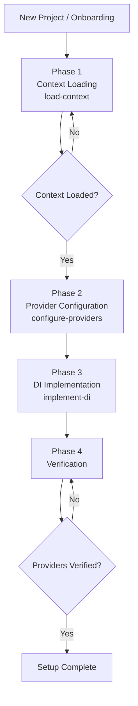

# Agent Guide — hanakai-yaku

Agent workflows for Hanami, dry-rb, and ROM development.

---

## Hanami Setup Agent

Orchestrates project onboarding: context discovery → provider configuration → DI → verification.

### Phase Flow

| Phase | Skill | Gate |
|-------|-------|------|
| 1. Context Loading | `load-context` | **Context Loaded** |
| 2. Provider Configuration | `configure-providers` | Quality Check |
| 3. DI Implementation | `implement-di` | Quality Check |
| 4. Verification | — | **Providers Verified** |

**Dependencies:** `load-context`, `configure-providers`, `implement-di`

---

## Planned Agents

### hanami-tdd *(Group 2)*

TDD feature cycle: Plan tests → Write tests → Implement → Review.

### slice-lifecycle *(Group 3)*

Slice development: Create slice → Test slice → Review slice boundaries.

---

## See Also

- [Skill Catalog](reference/skill-catalog.md) — All skills and agents
- [Integration Matrix](reference/integration-matrix.md) — Complete chaining reference
