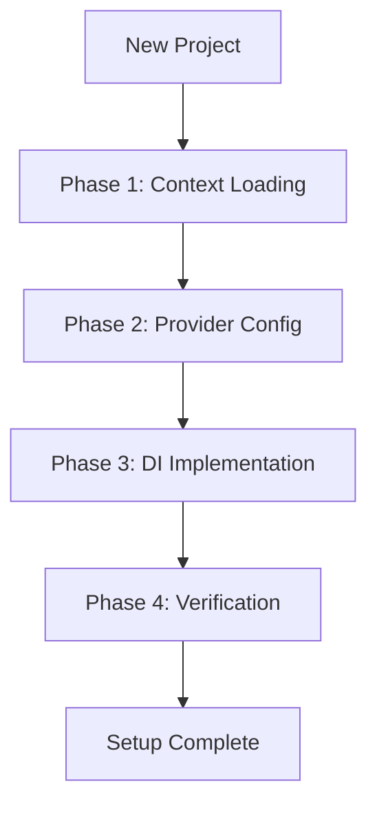

# Integration Matrix — hanakai-yaku

Integration matrix: which skill connects to which and in what order.

---

## Complete Agent Loop

### Hanami Setup



---

## Full Pipeline

```text
load-context → configure-providers → implement-di → verify
```

---

## Integrations by Skill

### load-context

| Next | When |
|------|------|
| configure-providers | After context, to set up or verify providers |
| implement-di | After context, to implement DI patterns |
| hanami-setup | First step in project onboarding |

### configure-providers

| Next | When |
|------|------|
| implement-di | After provider setup, inject into consumers |
| hanami-setup | Part of the onboarding workflow |

### implement-di

| Next | When |
|------|------|
| (Write tests) | After DI, write specs with test doubles |
| (Implement) | After DI and tests, implement the feature |

---

## Quick Decision Matrix

```text
New to the project?
  └─ load-context → discover structure

Need a new service?
  └─ configure-providers → implement-di

Full project setup?
  └─ hanami-setup (agent)
```

---

## Checkpoints and Gates

| Name | Type | Defined in | Purpose |
|------|------|------------|---------|
| Context Loaded | gate | load-context, hanami-setup | Don't proceed without knowing app structure |
| Providers Verified | gate | configure-providers, hanami-setup | All providers must boot without errors |

---

## See Also

- [Skill Catalog](skill-catalog.md) — Complete skills list
- [Agent Guide](../agent-guide.md) — Agent workflows with Mermaid diagrams
